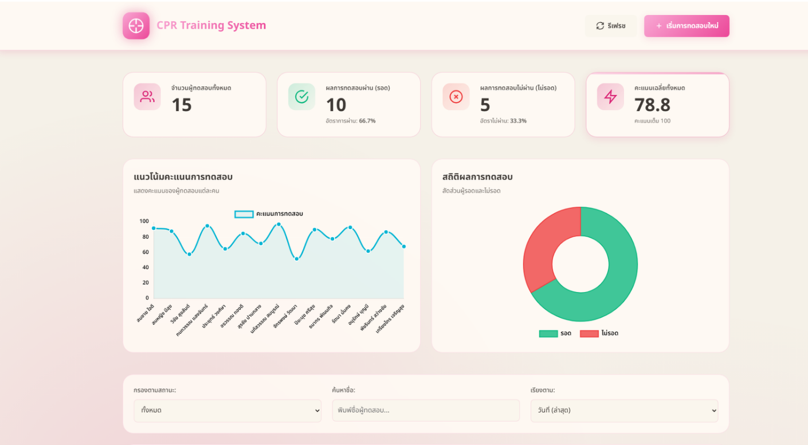
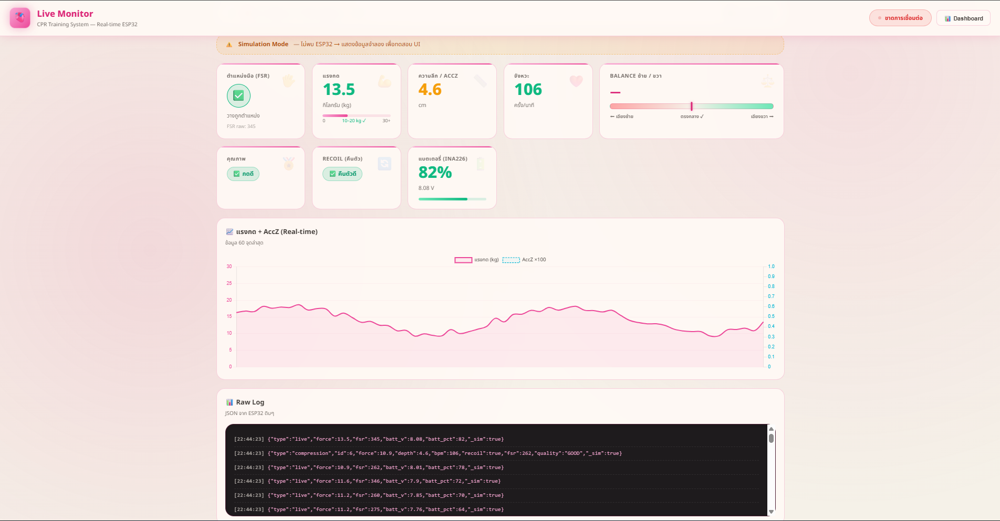
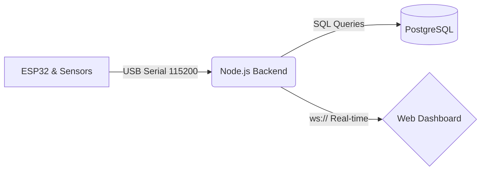

<div align="center">
  
# 🫀 CPR Training System & Live Monitor
**Advanced IoT Medical Training Platform**

[](#)
[](#)
[](#)
[](#)
[](#)

ระบบฝึกปั้มหัวใจ CPR สมัยใหม่ที่ผสานเซ็นเซอร์ความละเอียดสูงเข้ากับ Web Dashboard <br> สตรีมข้อมูลสดและประเมินผลเรียลไทม์ (Real-time Feedback)
  
</div>

<br>

<p align="center">
  <!-- นำรูปภาพหน้าจอเว็บมาเซฟทับหรือเปลี่ยนชื่อรูปเป็น dashboard.png ใส่ไว้ในโฟลเดอร์ assets -->
  
  <br><br>
  <!-- นำรูปภาพหน้าจอเว็บตอนดูกราฟมาเซฟทับหรือเปลี่ยนชื่อรูปเป็น live.png ใส่ไว้ในโฟลเดอร์ assets -->
  
</p>

---

## ✨ ไฮไลท์และฟีเจอร์หลัก (Key Features)

<table>
  <tr>
    <td width="33%" align="center">
      <h3>📈 Live Monitor</h3>
      <p>ตรวจโครงสร้างและกระแสดิบจากเซ็นเซอร์ผ่าน <b>WebSocket (ทุกๆ 100ms)</b> ช่วยให้เห็นกราฟแรงกดและความลึกทันทีที่ลงน้ำหนักมือ พร้อมสถานะแบตเตอรี่แบบสด</p>
    </td>
    <td width="33%" align="center">
      <h3>🎯 Training Module</h3>
      <p>จำลองสถานการณ์จริง (Gamification) พร้อมการนับจังหวะ (BPM) และคะแนนสม่ำเสมอ ประเมินการคืนรูปของหน้าอกอัตโนมัติ (Chest Recoil)</p>
    </td>
    <td width="33%" align="center">
      <h3>📊 Analytics Hub</h3>
      <p>หน้าควบคุมสำหรับอาจารย์ผู้สอน สรุปประวัติทั้งหมด วิเคราะห์อัตราการรอดชีวิตผ่าน <b>PostgreSQL</b> และ Chart.js สวยงามเข้าใจง่าย</p>
    </td>
  </tr>
</table>

---

## 🏗️ สถาปัตยกรรมระบบ (Architecture)

> กระบวนการรับส่งข้อมูลถูกออกแบบมาเพื่อ **ลดความหน่วง (Low Latency)** และให้ความสำคัญกับความแม่นยำของเซ็นเซอร์



* **Firmware (`/firmware`):** C++ วนลูปอ่านค่า HX711 (น้ำหนัก kg), MPU6050 (ความลึก Accelerometer) และ FSR ถอดรหัสส่งออกเป็น JSON
* **Backend (`/backend`):** Express.js ควบคุม SerialPort และทำหน้าที่ป้อนข้อมูลลงพอร์ต WebSocket
* **Frontend (`/frontend`):** ระบบ UI/UX ดีไซน์สวยงาม (Modern & Glassmorphism) ไม่ต้องพึ่งพา Framework หนักๆ 

---

## 🛠️ อุปกรณ์เซ็นเซอร์ (Hardware Components)

| โมดูล | หน้าที่หลัก | การเชื่อมต่อภาพรวม |
| :--- | :--- | :--- |
| **ESP32** | ไมโครคอนโทรลเลอร์สั่งการและประมวลผลสัญญาณหลัก | `Serial`, `I2C`, `A0` |
| **HX711 + Load Cell** | วัดแรงกดที่หน้าอก (แปลงค่าเป็น **กิโลกรัม kg**) | `DOUT`, `SCK` |
| **MPU-6050** | ตรวจความขยับขึ้นลง (Z-axis) เพื่อแปลค่าเป็น **ความลึก cm** | `I2C (SDA/SCL)` |
| **FSR 402** | Force Sensitive Resistor ตรวจจับตำแหน่งวางหน้ามือ | `Analog` |
| **INA226** | วัดโวลต์เตจและกระแสไฟของแบตเตอรี่ | `I2C (SDA/SCL)` |

---

## 🚀 เริ่มต้นใช้งานบนเครื่องส่วนตัว (Local Quick Start)

ระบบนี้รองรับการรันจำลอง **Simulation Mode** ได้แม้ไม่ได้เสียบฮาร์ดแวร์จริง ทำให้นำโปรเจกต์นี้ไปพรีเซนต์ได้ทุกที่ ทุกเวลา

### 1️⃣ การรันฝั่ง Database & Backend
1. **ติดตั้งฐานข้อมูล** แนะนำเป็น PostgreSQL จากนั้นตั้งชื่อ Database ว่า `cpr_training` และรันไฟล์ `backend/schema.sql` ให้ตารางเข้าที่
2. เข้าไปในโฟลเดอร์ Backend จัดเตรียม Dependencies:
   ```bash
   cd backend
   npm install
   ```
3. ตั้งค่าไฟล์ `.env` ใส่รหัสผ่าน DB และพอร์ต Serial
4. กดเปิดเซิร์ฟเวอร์
   ```bash
   node server.js
   ```

### 2️⃣ การเชื่อมต่อ Hardware & หน้าเว็บ
1. อัปโหลดไฟล์โค้ด `firmware/esp32_main/esp32_main.ino` ลงบอร์ด ESP32 ให้เรียบร้อย
2. ปิดหน้าต่าง Serial Monitor ในโปรแกรม Arduino ทิ้งเสีย! เพื่อป้องกันพอร์ตชน 
3. พิมพ์ที่อยู่เว็บเบราว์เซอร์ **http://localhost:3000** เริ่มใช้งานได้ทันที

---

**© 2026 Advanced IoT CPR Training System.** <br>
*Developed by Kittiphong and Team. Designed for Medical Educational Purposes.*
